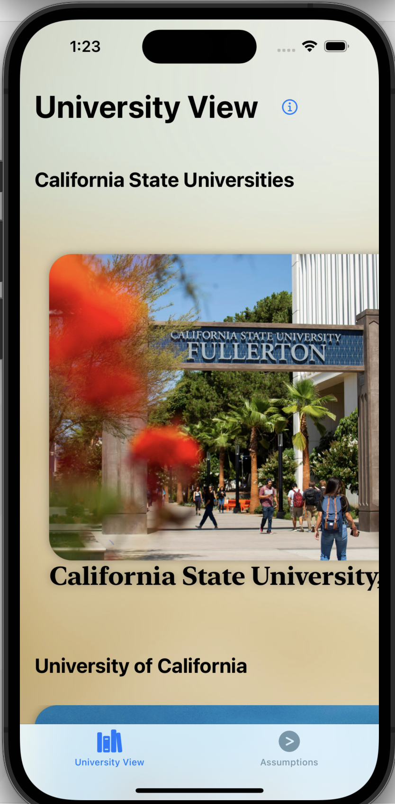
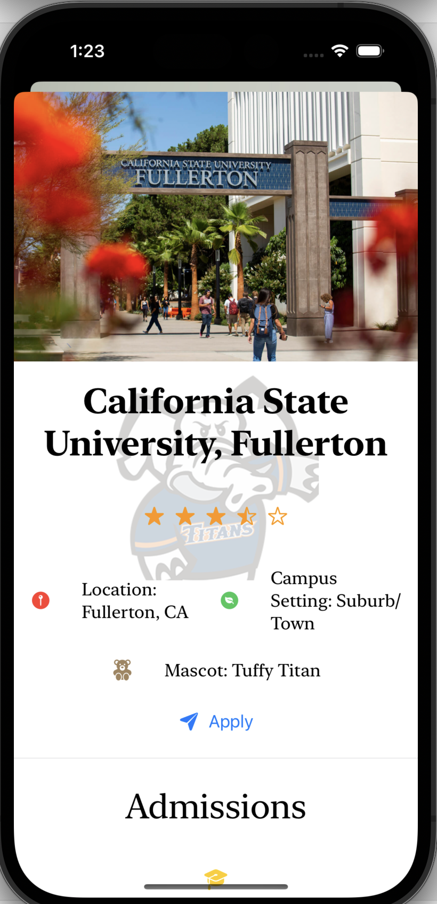
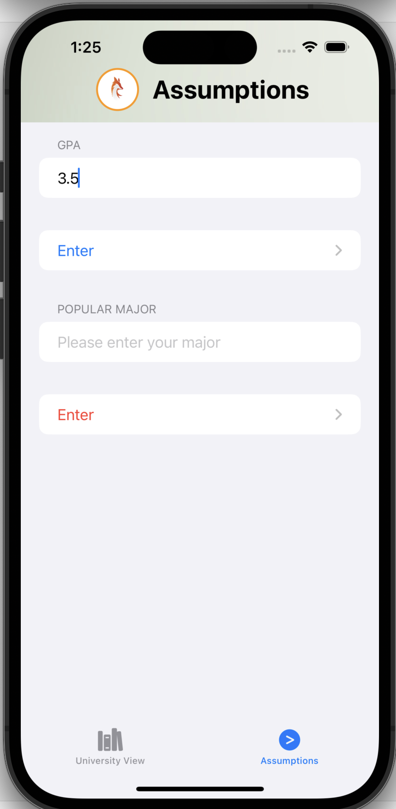
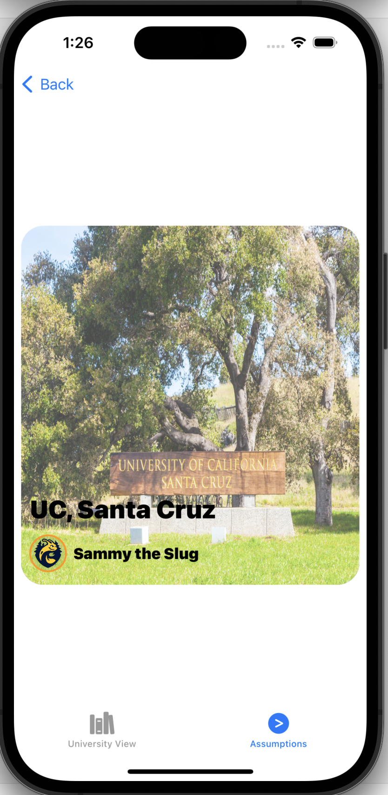

# ScholarFox
Junior year is an exciting and stressful time for high school students to apply to a university. The primary purpose of our application is to inform students about universities that are in California and give students their acceptance chances of getting into the university. The application will be solely for IOS devices. (An IOS application designed to inform and give users their likelihood of acceptance at a CSU or UC.)

# Product of the Scope
The product, ScholarFox, will be an IOS application designed with SwiftUI. The primary goal of the application is to provide students with a positive and non-stressful experience.  Our objective for the application is to help high school students approximate their chances of getting into a university of their choice. The application will have four features, but we will continue to add more as we progress.

## Features
1. The first feature allows users to explore the CSU and UC catalog to learn and help them determine which university they want to attend in the future. 
2. Feature two is a university approximation generator. This feature will display the universities students have a chance to get accepted based on the stats they provided for us.
3. Feature Three shows general infomation of universities.

# Members
Luis Alvarado (luisalvarado@csu.fullerton.edu)
Marco Gabriel (marcog10@csu.fullerton.edu)

# Sample
# Main Page

# Detail View

# Assumptions View

# Assumptions View

